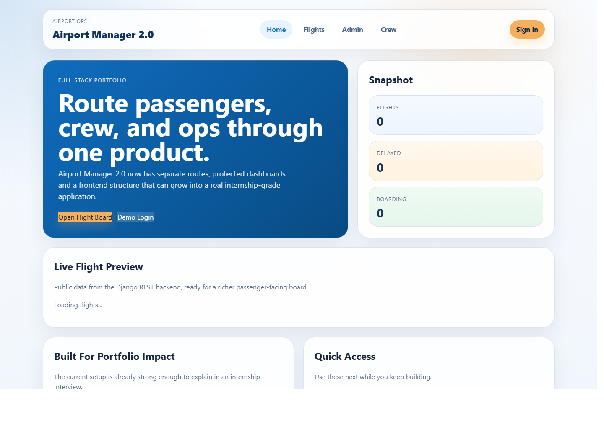
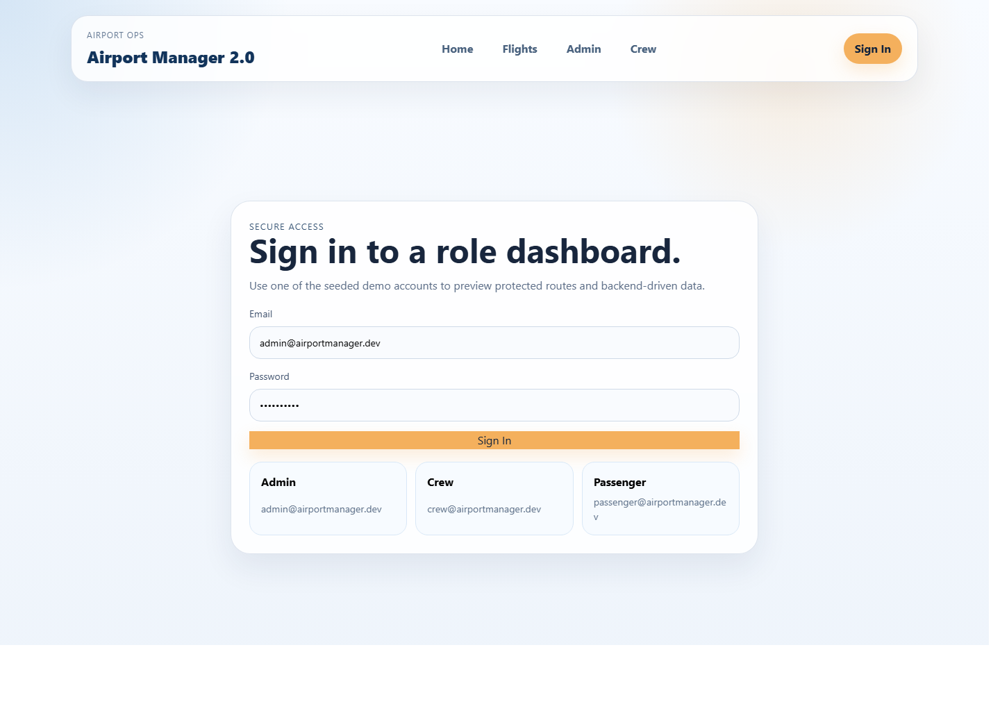
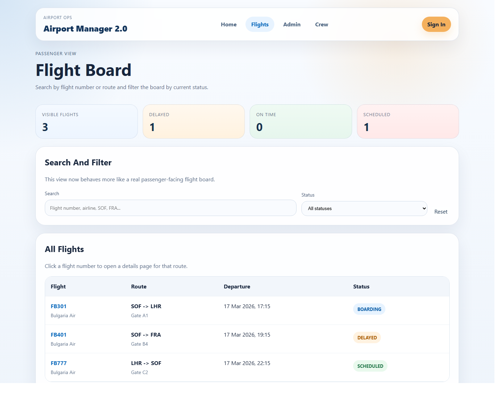
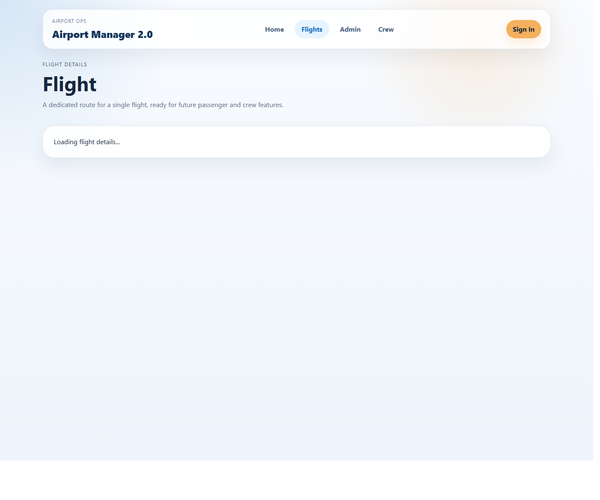

# Airport Manager 2.0

Airport Manager 2.0 is a full-stack web platform for airport flight operations, crew management, and passenger-facing flight tracking.

This project is built as an internship-ready portfolio application and focuses on realistic workflows, role-based access, API quality, and a clean dashboard experience.

## Highlights

- JWT authentication with role-based access for `Passenger`, `CrewMember`, and `Admin`
- public passenger flight board with search, filtering, and flight details pages
- protected admin and crew dashboards
- admin flight CRUD from the React UI
- Swagger / OpenAPI documentation for backend testing
- seeded demo accounts and sample flight data
- backend validation for flight route and schedule consistency

## Main Goals

- build a production-style full-stack project
- demonstrate backend and frontend integration
- show role-based access control and business logic
- present a clean and professional GitHub repository

## Implemented Features

- JWT authentication
- user roles: `Passenger`, `CrewMember`, `Admin`
- flights CRUD
- airport, airline, aircraft, and crew management
- search and filtering by destination, status, airline, and departure time
- passenger flights board
- passenger search and status filters
- flight details page
- crew dashboard
- admin operations dashboard
- admin dashboard CRUD workflow
- analytics summary cards
- OpenAPI / Swagger documentation
- automated tests

## Tech Stack

- Backend: Django, Django REST Framework
- Frontend: React, Vite
- Database: SQLite for local development
- Auth: JWT
- Styling: custom CSS
- Docs: drf-spectacular

## Repository Structure

```text
airport-manager-2.0/
  backend/
  frontend/
  docs/
    ARCHITECTURE.md
    ROADMAP.md
    TASKS.md
```

## Demo Accounts

- Admin: `admin@airportmanager.dev` / `admin12345`
- Crew: `crew@airportmanager.dev` / `crew12345`
- Passenger: `passenger@airportmanager.dev` / `passenger12345`

## Current Status

Project currently includes:

- Django project structure
- custom user model with roles
- JWT authentication endpoints
- airport, airline, crew, aircraft, and flight models
- DRF viewsets for core resources
- Swagger documentation support
- React frontend with route-based pages
- protected dashboard routes
- admin CRUD interface for flights
- passenger filters and flight details

## Why This Project Matters

Airport operations require accurate scheduling, clear permissions, and usable interfaces for both staff and passengers. This project simulates those workflows through a structured API and multiple dashboards.

## Portfolio Value

This repository is intended to showcase:

- REST API design
- relational database modeling
- authentication and permissions
- full-stack architecture
- testing and documentation

## Recommended Screenshots

Screenshots are stored in `docs/screenshots/`.

### Home Page



### Login Page



### Flights Board



### Flight Details



## Roadmap

See:

- `docs/ROADMAP.md`
- `docs/ARCHITECTURE.md`
- `docs/TASKS.md`

## Backend Quick Start

From `backend/` run:

```bash
..\..\venv\Scripts\python.exe manage.py migrate
..\..\venv\Scripts\python.exe manage.py seed_demo_data
..\..\venv\Scripts\python.exe manage.py runserver
```

Useful URLs:

- `http://127.0.0.1:8000/api/docs/`
- `http://127.0.0.1:8000/api/schema/`
- `http://127.0.0.1:8000/admin/`

Dashboard endpoints:

- `http://127.0.0.1:8000/api/dashboard/admin/`
- `http://127.0.0.1:8000/api/dashboard/crew/`

## Frontend Quick Start

From `frontend/` run:

```bash
npm install
npm run dev
```

The Vite dev server runs at:

- `http://localhost:5173/`

Keep the Django backend running on port `8000` while using the frontend so the dev proxy can forward `/api` requests.

## Suggested Demo Flow

1. Open the login page and sign in with the admin demo account.
2. Show the admin dashboard cards and upcoming flights.
3. Create or edit a flight from the CRUD form.
4. Open the passenger flight board and filter by status.
5. Open a single flight details page.

## Future Improvements

- real-time updates with WebSockets
- notifications for delays and cancellations
- audit log for admin changes
- Docker support
- CI pipeline
- deployment to Render and Vercel
