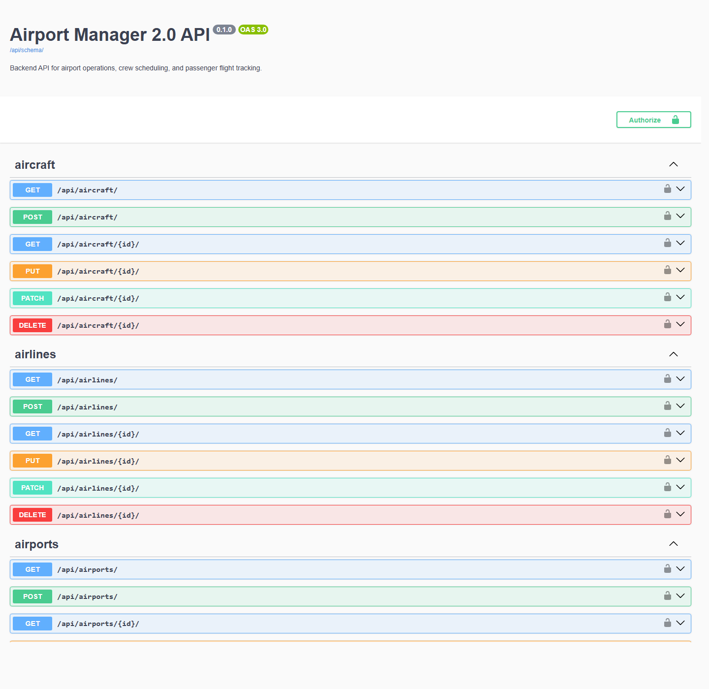

# Airport Manager 2.0

Airport Manager 2.0 is a full-stack web application for airport operations, crew coordination, and passenger-facing flight tracking. It was built as an internship-ready portfolio project with the goal of showing how a realistic product can be structured across a Django REST backend and a React frontend.

Instead of being just another CRUD demo, the project is designed around a small but believable airport workflow. Passengers can browse flights, search by route or flight number, and open a dedicated details page for a selected flight. Crew members and administrators have protected dashboard views, while admins can manage flights directly from the frontend UI.

The main focus of the project is not only on functionality, but also on clear API design, role-based access control, realistic data relationships, and a clean presentation in GitHub.

## What The Project Includes

Airport Manager 2.0 currently includes:

- JWT authentication for role-based access
- public passenger flight board with search and status filtering
- dedicated flight details page
- protected admin dashboard
- protected crew dashboard
- admin CRUD workflow for flights from the React UI
- airport, airline, aircraft, flight, and crew-related backend models
- OpenAPI / Swagger documentation for backend exploration and testing
- seeded demo data and ready-to-use demo accounts
- backend validation for route consistency and flight timing
- automated backend tests

## Why This Project Matters

Airport systems need clear scheduling, predictable permissions, and reliable information for different types of users. This project simulates those needs in a smaller portfolio-friendly format.

It is meant to demonstrate:

- backend API design with Django REST Framework
- relational database modeling
- authentication and authorization
- frontend and backend integration
- practical product thinking, not just isolated pages
- documentation and presentation quality for recruiters

## User Roles

The application is structured around three main roles:

- `Passenger` can browse the public flight board, search for routes, and inspect flight details
- `CrewMember` can access a protected dashboard with assignment-related information
- `Admin` can access operations data and manage flights directly from the frontend

## Tech Stack

- Backend: Django, Django REST Framework
- Frontend: React, Vite
- Database: SQLite for local development
- Authentication: JWT
- API documentation: drf-spectacular / Swagger UI
- Styling: custom CSS

## Project Structure

```text
airport-manager-2.0/
  backend/
  frontend/
  docs/
    ARCHITECTURE.md
    ROADMAP.md
    TASKS.md
    screenshots/
```

## Demo Accounts

You can explore the protected areas of the application with the seeded demo users below:

- Admin: `admin@airportmanager.dev` / `admin12345`
- Crew: `crew@airportmanager.dev` / `crew12345`
- Passenger: `passenger@airportmanager.dev` / `passenger12345`

## Screenshots

Screenshots are stored in `docs/screenshots/`.

### Home Page


### Login Page


### Flights Board


### API Docs



## Backend Setup

From the `backend/` directory, run:

```bash
..\..\venv\Scripts\python.exe manage.py migrate
..\..\venv\Scripts\python.exe manage.py seed_demo_data
..\..\venv\Scripts\python.exe manage.py runserver
```

Useful backend URLs:

- `http://127.0.0.1:8000/`
- `http://127.0.0.1:8000/api/docs/`
- `http://127.0.0.1:8000/api/schema/`
- `http://127.0.0.1:8000/admin/`

Protected dashboard endpoints:

- `http://127.0.0.1:8000/api/dashboard/admin/`
- `http://127.0.0.1:8000/api/dashboard/crew/`

## Frontend Setup

From the `frontend/` directory, run:

```bash
npm install
npm run dev
```

The frontend runs at:

- `http://localhost:5173/`

Keep the Django backend running on port `8000` while using the frontend so the Vite proxy can forward `/api` requests correctly.

## Suggested Demo Flow

If you want to present the project quickly to a recruiter, interviewer, or lecturer, this is a good order:

1. Open the login page and sign in with the admin demo account.
2. Show the admin dashboard cards and upcoming flights.
3. Create, edit, or delete a flight from the admin interface.
4. Open the public flight board and use the search or status filters.
5. Open a single flight to show the passenger-facing details page.
6. Open Swagger to show the documented backend API.

## Current State

The project already covers the core internship portfolio goals:

- a working backend API
- documented endpoints
- protected and public routes
- data validation
- admin functionality from the frontend
- a presentable GitHub repository structure

There is still room to extend it into a larger system, but it already works well as a serious portfolio piece.

## Possible Next Steps

Future improvements could include:

- real-time flight updates with WebSockets
- notifications for delays and cancellations
- audit logs for admin actions
- Docker setup
- CI pipeline
- deployment to a public hosting platform

## Additional Documentation

For more planning and architecture notes, see:

- `docs/ROADMAP.md`
- `docs/ARCHITECTURE.md`
- `docs/TASKS.md`
